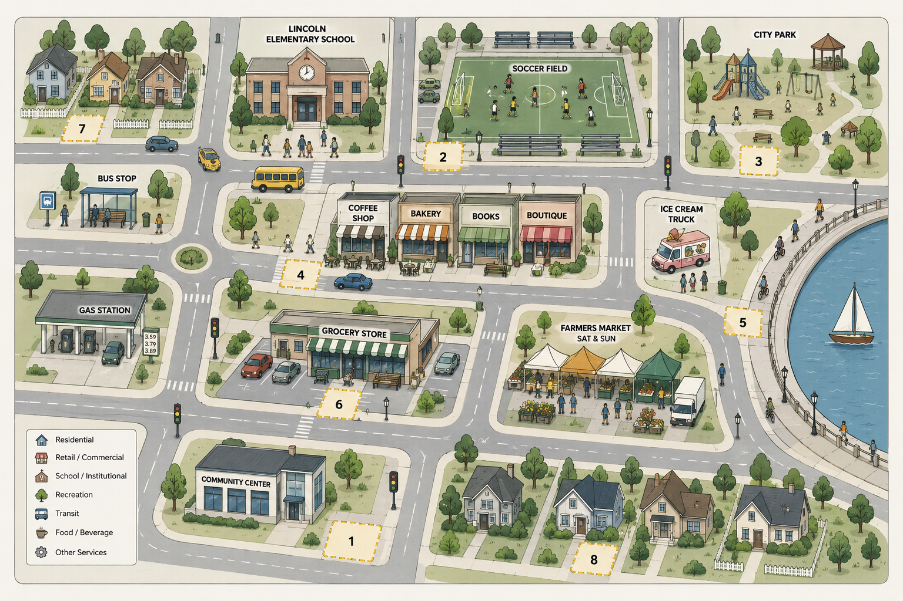

# Authoring guide — voice, page anatomy, components

Use this when writing or editing any module page so the course keeps one voice and
one feel. `01-customer.html` is the reference page: when in doubt, copy what it does.

---

## 1. Who we're writing for

Busy professionals who are **not technical**. Smart, experienced in their own field,
maybe a little nervous about AI, maybe a little skeptical. Many have only typed a
few questions into a chatbot. They should finish each module thinking:

> "Oh — I can do this. And I see my own work differently now."

## 2. The voice (warm, plain, honest, encouraging — Anthropic-style)

| Do | Don't |
|---|---|
| Talk like a kind, capable friend sitting next to them | Lecture like a professor or pitch like a salesperson |
| Plain words, short sentences, one idea per paragraph | Jargon, long clauses, stacked abstractions |
| Explain any term the first time, in one everyday sentence | Assume they know "context window", "agent", "LLM" |
| Show an example first, then name the idea | Open with the principle |
| Use everyday analogies (see list below) | Use technical analogies (APIs, compilers, tokens) |
| Normalize struggle: "Everyone's first try looks generic." | Imply they did it wrong |
| Celebrate progress: "That's the whole skill. You just did it." | Over-praise or gush |
| Be honest about limits: AI can be confidently wrong | Hype, or fear |
| Invite reflection: "Think of the report you write every Monday…" | Leave the lesson stuck at the lemonade stand |

**Banned words:** revolutionary, game-changing, unleash, supercharge, leverage (verb),
synergy, cutting-edge, seamless, magic bullet, 10x, robust, utilize, paradigm. No emoji.
At most **one** lemon pun per page — and only if it's actually good.

**Reading level:** aim for a smart 14-year-old. If a sentence needs a second read, split it.

**Claude** is a collaborator, never a tool that "does it for you" and never a person.
Good: *"Claude is like a brilliant new colleague on their first day — it knows a lot
about the world, and nothing yet about you."*

### Everyday analogies that work

- **Context** — briefing a new colleague on day one; a GPS that only knows the roads you've shown it.
- **Vague prompt → generic answer** — asking a stranger "recommend a restaurant?" vs. telling a friend what you're in the mood for.
- **Clarifying questions** — a good contractor who asks before building; a doctor who asks before prescribing.
- **Citation vs. reason** — a receipt shows *where* you bought it, not *why* you bought it.
- **Skill** — a recipe card: anyone can follow it, but it holds the recipe, not the cook's instincts.
- **Agent** — a house-sitter with your keys: helpful *because* of the access, and that's also the risk.
- **Fan-out-and-synthesize** — a kitchen: one cook per station, the head chef plates it.
- **Adversarial verification** — an editor and a fact-checker who haven't seen each other's notes.
- **Loop-until-done** — "keep stirring until it thickens."
- **Tournament** — a bake-off, round by round.

### The "new dimension" moment

Every module has one reframe — a single sentence that changes how they see AI
(and their own job). It appears three times: in the **Big idea** box (frame column),
named in the middle of the page, and landed in the **Takeaway**. Examples:
- "The skill isn't in the AI. It's in how you brief it."
- "What you know that was never written down is now *more* valuable, not less."
- "Reliability isn't something a model has. It's something you design around it."

---

## 3. Page anatomy (every module)

```
<head>  … course.css, extra.css, learn.css, gate guard …
<body data-slug="…" data-module="N">
  <div id="siteHeader"></div>
  <main>
    FRAME (left)   module-id · h1.question · .bigidea · .meta-chips
                   frame-rows (The situation / Your part / You'll learn)
                   .frame-row.tool + .inputs + details.how
                   dl.terms  ("Words to know", 2–4 terms, plain English)
    WORK (middle)  .scene (story, 3–5 sentences, a real person/number from the data)
                   sections, each opening with <h2 class="sec"><span class="sec-kicker">…</span>Title</h2>
                     1. Try it            — naive prompt, what you'll see (.claude-out sample)
                     2. What's going on   — the idea, plain English, with an analogy
                     3. Try it again      — annotated prompt (click to see why each part is there)
                     4. Click-and-learn   — the module's interactive (map, calculator, hunt, sorter…)
                     5. Quick check       — 1–3 .quiz items with kind, explaining feedback
                   .checkpoint (pass / stuck + helper)  ← stays exactly like 01
                   .check-confirmed
                   .post-checkpoint:
                     details.deep ("Under the hood, in plain English")
                     .voices ("From the class") when the source has quotes
                     .transfer ("Try it at work")
                     .takeaway (lands the reframe; encouraging)
                     .closing-call
    LAND (right)   Reflect: the EXACT reflection questions, in order (they feed the report)
                   friendly .q-hint under each · .can-say
  </main>
  <div id="siteFooter"></div>
  scripts: config, registry, chrome, sync, learn, course   (+ pdf, handin on the finale)
```

**Never change a reflection question's wording or order** — they are matched to
`assets/registry.js` and printed in the participant's report. Hints are yours to write.

Length target: the Work column should take **12–20 minutes** to do with Claude open.

---

## 4. Components (markup contracts)

All behaviour lives in `assets/learn.js`; styles in `assets/learn.css`.

### Section heading
```html
<h2 class="sec"><span class="sec-kicker">Step 1 · Try it</span>Ask the way most people would</h2>
<p class="body">Plain paragraph text uses class "body".</p>
```

### Big idea + meta chips (frame column)
```html
<div class="bigidea"><p class="bi-k">The big idea</p><p class="bi-v">One sentence reframe.</p></div>
<div class="meta-chips"><span class="chip">~15 min</span><span class="chip">Claude open in another tab</span></div>
```

### Words to know (frame column, last)
```html
<dl class="terms"><p class="t-head">Words to know</p>
  <dt>Prompt</dt><dd>What you type to Claude. Think of it as a brief.</dd>
</dl>
```

### Sample Claude response (not copyable)
```html
<div class="claude-out"><div class="co-head">Claude · sample response</div>
  <div class="co-body"><p>…</p><ul><li>…</li></ul></div></div>
<p class="co-verdict">What to notice: …</p>
```

### Annotated prompt (click the highlighted parts)
```html
<div class="annotated">
  <div class="sample-prompt ap-body">You're helping me <span class="ap-seg" data-ap="1">plan a lemonade stand in Lakeside</span>. …</div>
  <p class="ap-hint">Click a highlighted part to see why it's there.</p>
  <div class="ap-callout"></div>
  <ol class="ap-notes">
    <li data-ap="1"><b>Who and where.</b> Plain-English reason this part matters.</li>
  </ol>
</div>
```
Copy still works (the badges are drawn by CSS and not copied).

### Tabs (before/after, steps)
```html
<div class="tabs">
  <div class="tab-bar"><button class="tab active" data-tab="a">First try</button><button class="tab" data-tab="b">Second try</button></div>
  <div class="tab-panel" data-panel="a">…</div>
  <div class="tab-panel" data-panel="b">…</div>
</div>
```

### Quick check (quiz with kind feedback)
```html
<div class="quiz">
  <p class="quiz-k">Quick check</p>
  <p class="quiz-q">Question?</p>
  <div class="quiz-opts">
    <button class="quiz-opt" data-correct="true">Option<template class="fb">Why this is right, warmly.</template></button>
    <button class="quiz-opt">Option<template class="fb">Why not — gently, and what to think instead.</template></button>
  </div>
</div>
```
Feedback is prefixed automatically with "Yes." or "Not quite." Several quizzes in a row: wrap in `<div class="quiz-grid">`. Add `compact` for short option labels.

### Guess, then reveal
```html
<div class="reveal">
  <p class="reveal-k">Make a guess</p>
  <p class="reveal-q">Before you look: …?</p>
  <textarea class="reveal-guess" placeholder="Your guess (just for you)…"></textarea>
  <button class="reveal-btn">Reveal</button>
  <div class="reveal-body" hidden><p>…</p></div>
</div>
```
Two side by side: wrap in `<div class="reveal-row">`.

### Clickable map
```html
<div class="hotspot-map">
  <div class="hm-stage">
    
    <button class="hotspot" data-spot="1" data-x="38.9" data-y="89.9">1</button> …
  </div>
  <p class="hm-status"><span class="hm-count"></span><span>Click a numbered corner</span></p>
  <div class="hm-panel"><p class="hm-sub">Click any numbered corner to see what's there — and what the map can't tell you.</p></div>
  <div class="hm-data">
    <div data-spot="1"><h4>…</h4><p class="hm-sub">…</p><div class="hm-grid"><div><b>Label</b>…</div></div>
      <p class="hm-quote">"…"</p><p class="hm-blind">What the map can't tell you: …</p></div>
  </div>
</div>
```

### Finder (hunt for the problems)
```html
<div class="finder" data-label="Problems found:">
  <table class="ledger">… <td class="num" data-hit="Why this is a problem">$480</td> … <td class="num" data-miss="Checks out: …">$302</td> …</table>
  <div class="finder-bar"><span class="finder-status"></span><button class="reveal-btn finder-show">Show me</button></div>
  <div class="finder-msg"></div>
  <div class="finder-done" hidden>Nice work — …</div>
</div>
```
Works on any element (`li`, `span`, `td`). Messages are attribute values: escape `"` as `&quot;`.

### Sorter (sort into categories)
```html
<div class="sorter" data-choices="a:Bottles well|b:Partly|c:Won't travel">
  <div class="sort-item" data-answer="a"><p class="sort-text">Item</p><template class="fb">Why.</template></div>
</div>
```

### Expandable cards
```html
<div class="xgrid">
  <details class="xcard built"><summary><span class="xc-title">Title<span class="xc-tag">You built this</span></span>
    <span class="xc-fig"><svg …></svg></span><span class="xc-line">One-line summary.</span></summary>
    <div class="xcard-more"><h5>Use it when</h5><p>…</p></div></details>
</div>
```

### Under the hood / voices / transfer / facts
```html
<details class="deep"><summary>Under the hood, in plain English</summary><div class="deep-body"><p>…</p></div></details>
<div class="voices"><p class="v-head">From the class</p><blockquote class="voice">"…"<span class="voice-who">— a participant</span></blockquote></div>
<div class="transfer"><p class="tr-label">Try it at work</p><p>…</p></div>
<div class="factbar"><div class="fact"><div class="fact-n">12</div><div class="fact-l">interviews</div></div></div>
```

### Range chart
```html
<div class="ranges"><p class="rg-title">Title</p>
  <div class="range-row"><span class="rr-name">Doris</span><span class="rr-track"><span class="rr-bar" style="left:14.3%;width:7.1%"></span></span><span class="rr-val">$1–1.50</span></div>
  <div class="rr-axis"><span></span><span class="rr-ticks"><span style="left:0%">$0</span>…<span style="left:100%">$7</span></span><span></span></div>
</div>
```
Positions are percent of a $0–$7 scale (`left = low/7`, `width = (high−low)/7`).

### Price calculator (Module 03 only)
```html
<div id="priceCalc"></div>
```
Everything inside is generated from the cost workbook by `learn.js`.
